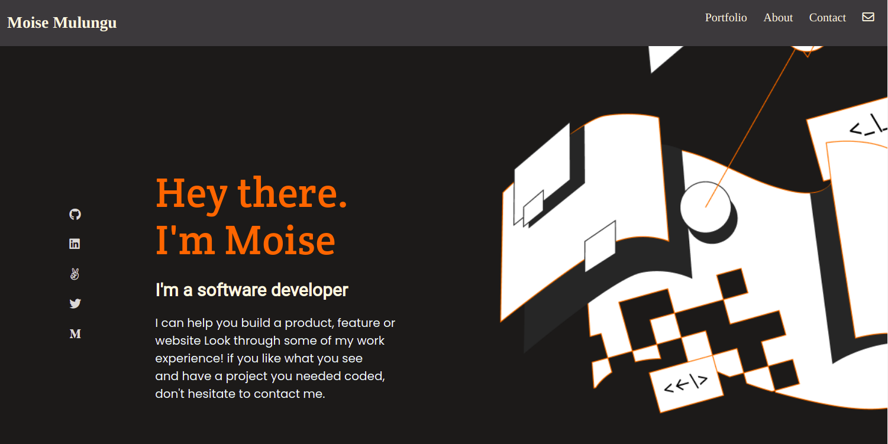

# Portfolio: Mobile Version

> This is my Portfolio Desktop project.

I use this project to learn about Linters, Github Workflows, Css grid/flexbox, image queries and hover.

## Built With

- HTML
- CSS (grid, flexbox)
- Visual Studio Code

## Author

👤 **Moise Mulungu**

- GitHub: [Moise Mulungu](https://github.com/moise-mulungu)
- Twitter: [Moise Mulungu](https://twitter.com/moise_mulungu)
- LinkedIn: [Moise Mulungu](https://www.linkedin.com/in/mo%C3%AFse-mulungu-a939831b2/)

## 🤝 Contributing

Contributions, issues, and feature requests are welcome!

## Show your support

Give a ⭐️ if you like this project!
 
 
 
 
 
 
 
 
 
 
 
 
 
 
 

