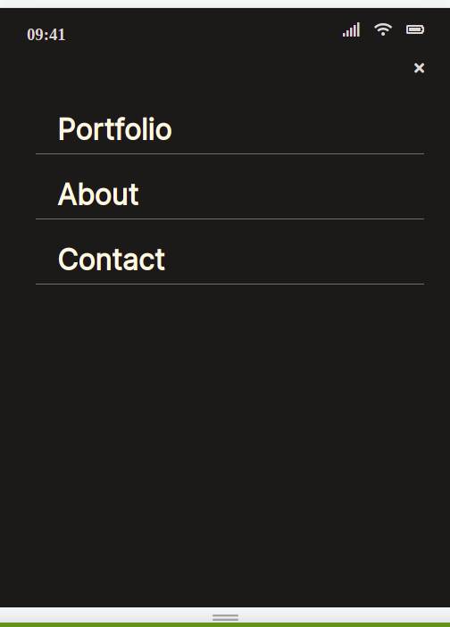

# Portfolio: Mobile Menu

> This is another project completing the mobile menu page.

In this project, we worked on mobile menu by using javascript event listeners to make the page interactive.

## Built With

- HTML
- CSS (grid, flexbox)
- Visual Studio Code.
- JavaScript.

## Live Demo
[link](https://moise-mulungu.github.io/portfolio-mobile-version/)

## Author1

👤 **Moise Mulungu**

- GitHub: [Moise Mulungu](https://github.com/moise-mulungu)
- Twitter: [Moise Mulungu](https://twitter.com/moise_mulungu)
- LinkedIn: [Moise Mulungu](https://www.linkedin.com/in/mo%C3%AFse-mulungu-a939831b2/)

## Author2

👤 **Zahra Arshia**

- GitHub: [Zahra Arshia](https://github.com/zahraarshia)
- Twitter: [Zahra Arshia](https://twitter.com/Zahraarshia)
- LinkedIn: [Zahra Arshia](https://www.linkedin.com/in/zahra-arshia-89247210a/)

## 🤝 Contributing

Contributions, issues, and feature requests are welcome!

## Show your support

Give a ⭐️ if you like this project!
 
 
 
 
 
 
 
 

